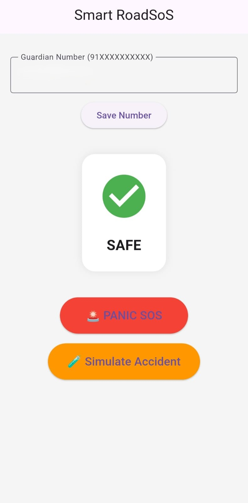
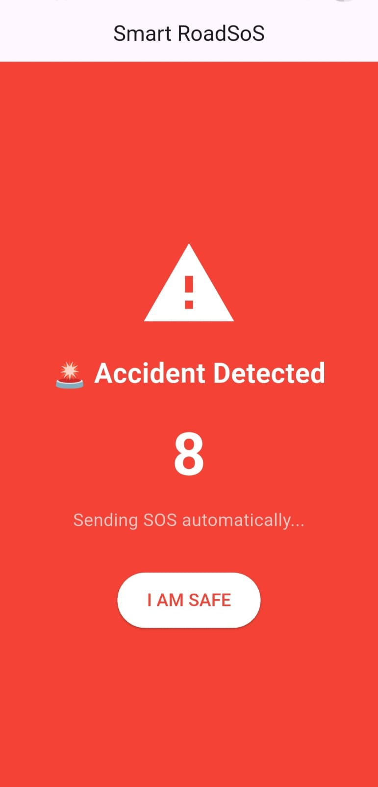
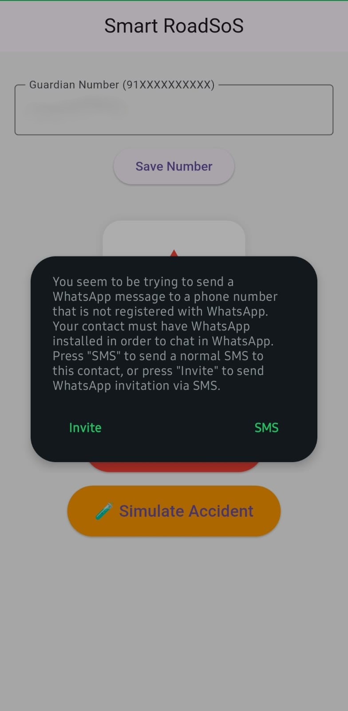
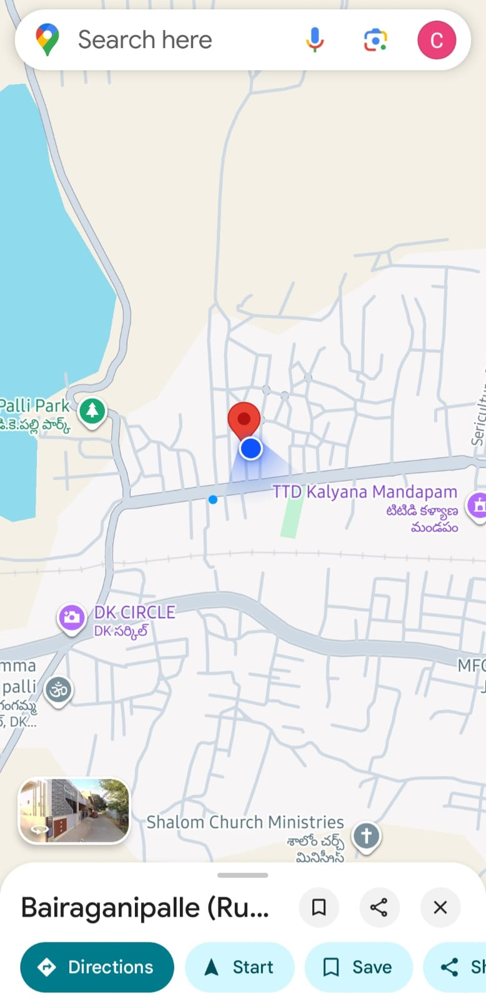
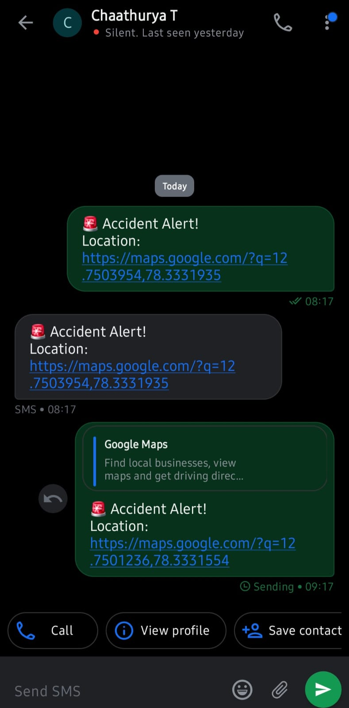

# 🚨 Smart RoadSoS

<p align="center">

**Transforming Smartphones into Intelligent Road Safety Companions**

Flutter • Dart • Android • Road Safety • GPS • Emergency Response

</p>

---

## 📖 Overview

**Smart RoadSoS** is a Flutter-based mobile application designed to provide rapid emergency assistance during road accidents.

The application continuously monitors smartphone accelerometer data to detect potential accidents, classifies movement into multiple risk levels, and automatically sends SOS alerts containing the victim's live GPS location through **WhatsApp** and **SMS**.

Developed for the **IIT Madras National Road Safety Hackathon 2026**, Smart RoadSoS demonstrates how an ordinary smartphone can become an intelligent emergency response system without requiring additional hardware.

---

# ✨ Key Features

* 🚗 Automatic Accident Detection
* 📊 Real-Time Motion Monitoring
* ⚠️ Risk Classification

  * SAFE
  * HIGH RISK
  * ACCIDENT
* ⏳ Emergency Countdown
* ✅ "I AM SAFE" False Alert Cancellation
* 📍 GPS Live Location Retrieval
* 💬 WhatsApp SOS Alerts
* 📱 SMS SOS Alerts
* 👥 Emergency Contact Storage
* 🚨 Manual Panic SOS
* 🧪 Accident Simulation Mode
* 📦 Android APK Deployment

---

# 📸 Application Screenshots

## 🏠 Home Screen

Main application interface showing emergency contact management, current safety status, Panic SOS, and Accident Simulation.



---

## 🚨 Accident Detection

Automatic accident detection with a 10-second emergency countdown.

Users can cancel false alerts using the **"I AM SAFE"** button.



---

## 📨 SOS Alert Messages

Emergency notifications sent through WhatsApp and SMS containing live GPS location.



---

## 📍 Live GPS Location

Shared Google Maps location enabling emergency contacts to navigate directly to the accident site.



---

## 📱 SMS Emergency Alert

SMS fallback mechanism ensuring emergency alerts can still be delivered when WhatsApp is unavailable.



---

# 🏗️ System Workflow

```text
Accelerometer
        │
        ▼
Real-Time Motion Monitoring
        │
        ▼
Motion Force Calculation
        │
        ▼
Risk Classification
 SAFE │ HIGH RISK │ ACCIDENT
        │
        ▼
Emergency Countdown
        │
        ├────────► "I AM SAFE"
        │             │
        │             ▼
        │       Cancel Emergency
        │
        ▼
Retrieve GPS Location
        │
        ▼
Generate Google Maps Link
        │
        ▼
WhatsApp + SMS SOS Alert
```

---

# 💻 Technology Stack

| Technology         | Purpose                                 |
| ------------------ | --------------------------------------- |
| Flutter            | Cross-platform Mobile Development       |
| Dart               | Programming Language                    |
| sensors_plus       | Accelerometer Monitoring                |
| geolocator         | GPS Location Retrieval                  |
| shared_preferences | Emergency Contact Storage               |
| url_launcher       | WhatsApp, SMS & Google Maps Integration |
| Android SDK        | Android Deployment                      |

---

# ⚙️ Working Methodology

1. Continuously monitor accelerometer sensor values.
2. Calculate motion force from sensor readings.
3. Classify movement into SAFE, HIGH RISK, or ACCIDENT.
4. Trigger emergency countdown upon accident detection.
5. Allow the user to cancel false alarms using the **"I AM SAFE"** button.
6. Retrieve the current GPS location.
7. Generate a Google Maps navigation link.
8. Automatically dispatch emergency notifications via WhatsApp and SMS.

---

# 🌟 Project Highlights

* ✅ No additional hardware required
* ✅ Smartphone-based accident detection
* ✅ Automatic emergency response
* ✅ GPS Live Location Sharing
* ✅ False Alert Prevention
* ✅ Manual Panic SOS
* ✅ Android APK Available
* ✅ Real Device Tested
* ✅ Built using Flutter

---

# 📂 Repository Structure

```text
Smart-RoadSoS/
│
├── android/
├── ios/
├── lib/
├── assets/
│   └── screenshots/
│       ├── 01_home_screen.jpeg
│       ├── 02_accident_detection.jpeg
│       ├── 03_sos_messages.jpeg
│       ├── 04_live_location.jpeg
│       └── 05_sms.jpeg
│
├── test/
├── web/
├── windows/
├── linux/
├── macos/
├── pubspec.yaml
├── pubspec.lock
└── README.md
```

---

# 🚀 Future Enhancements

* 🤖 AI-Based Accident Prediction
* 🚑 Ambulance API Integration
* 🚓 Police Notification System
* 🏥 Nearby Hospital Locator
* ⌚ Smartwatch Integration
* 🎙️ Voice Activated SOS
* ☁️ Cloud Dashboard
* 📊 Emergency Analytics

---

# 🏆 Hackathon

**National Road Safety Hackathon 2026**

**Organized By**

Centre of Excellence for Road Safety (CoERS)

Indian Institute of Technology Madras (IIT Madras)

**Theme**

RoadSoS – AI in Road Safety

---

# 👨‍💻 Team

**Team Road Sentinel**

PSG Institute of Technology and Applied Research

Computer Science and Engineering

---

# ⭐ Support

If you found this project useful, consider giving this repository a **⭐ Star**.

Thank you for visiting **Smart RoadSoS**.
